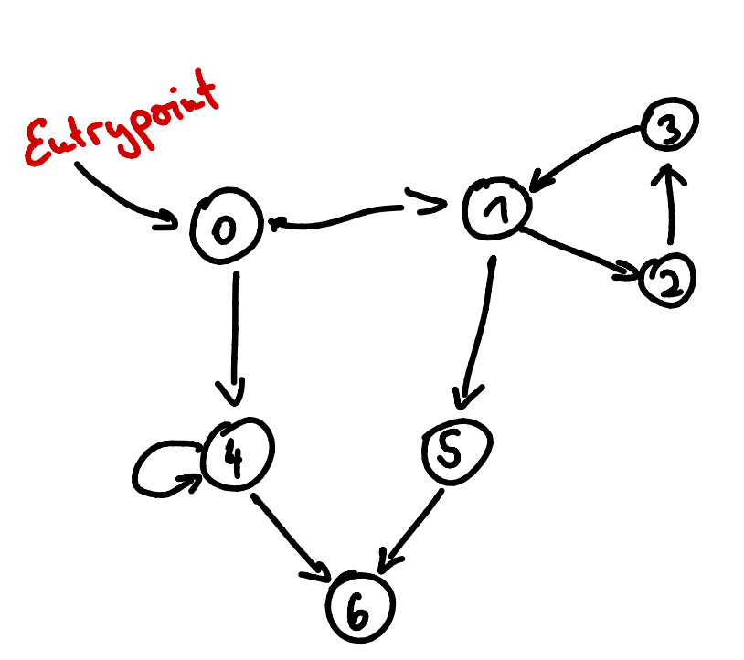

# GraphQL-Testautomatisierung

Mit einer zunehmenden Addaption von GraphQL werden Tools benötigt, welche die Qualität von GraphQL-Apis testen.
Ein Ansatz der zeitsparend und eine gute Test-Coverage verspricht ist es, Tests automatisch generieren zu lassen. 
Da die Datenstruktur innerhalb einer GrahpQL-Api dynamisch mittels eines Graphens dargestellt wird ergibt sich hier 
eine höhere Komplexität als bei einer REST-API da im Gegensatz zu REST der Anfrageraum im Zweifelsfall unendlich sein kann.
Im Rahmen der "International Conference on Automation of Software Test 2021" wurde ein Paper "Automatic Property-based Testing of GraphQL-APIs" veröffentlich
welches einen Ansatz zur automatischen Testgenerierung liefert. 
Dieses Paper kümmert sich vor allem um Property-Based Testing, einen Ansatz der insbesondere die Datenstruktur eines einzelnen 
Objektes betrachtet. Da GraphQL-Schemas aber auch andere Objekte als Propertys haben können müssen diese aufgelöst werden was zu Problemen
führen kann, da z.B. Kreise hier eine endlose Auflösung zur Folge haben können. Um diese Problem zu lösen wurde im Paper die Rekursionstiefe
auf 3 festgelegt. Dies bedeutet, dass keine optimale Coverage jeden GraphQL-Schemas mit dieser Methode erreicht werden kann. 
Man stelle sich ein GraphQL-Schema vor, welches folgende Struktur hat (i.A. ist der Graph hier eher ein Subgraph eines größeren Schemas): 

Ein GraphQL-Schema hat verschiedene Einstiegspunkte von welchem beginnend aus die Anfragen gestellt werden können. 
Mit der aktuellen Methode ist es nicht möglich, ein volles Testen des Graphens zu erreichen. 
Ausgehend vom Entrypoint 0 wäre es nur möglich Tests für die Routen 

* 0
* 0 - 1 
* 0 - 1 - 2
* 0 - 1 - 5
* 0 - 4
* 0 - 4 - 4
* 0 - 4 - 6

zu erstellen. Der Ansatz die Rekursionstiefe zu beschränken ist allerdings nicht nötig da Graphalgorithmen existieren die eine 
Full-Coverage erstellen können auch auf zyklischen Graphen. Hierbei sei vorallem die Prime-Path Coverage genannt. 
Mithilfe dieser ist es möglich den kompletten Graphen abzudecken und wesentlich mehr Test-Cases zu generieren. Der Algorithmus hat 
als Ergebnis die Prime-Paths eines Graphen. Die Prime-Paths sind die Pfade, die man gehen muss um alle Kanten und alle Knoten einmal zu passieren und somit
im Test zu berücksichtigen. In der Generierung dieser Prime-Paths entstehen unter anderem auch die selben Pfade wie beim Property-Based Ansatz, jedoch noch mehr. 
Mithilfe des Prime-Path Covering erreichen wir insgesamt diese Routen für Tests (wie man hierauf kommt, folgt später) :

* 0
* 0 - 1 
* 0 - 4
* 0 - 1 - 2
* 0 - 1 - 5
* 0 - 4 - 6
* 0 - 4 - 4
* 0 - 1 - 2 - 3
* 0 - 1 - 5 - 6

Die Wahl der maximalen Rekursionstiefe hat einen signifikanten Einfluss auf die 
Qualität der Tests, jedoch wurde im Paper keine Möglichkeit angegeben, die Rekursionstiefe für eine gute Coverage abzuschätzen. 
Mit dem Ansatz dieses Problem über Prime-Path Covering zu lösen entfällt die Wahl eines solchen Parameters komplett.
In diesem relativ simplen Graphen werden somit schon 2 weitere Testrouten entdeckt.
Jeder Graph, der eine komplexere Struktur bekommt, würde hier auch eine wesentlich höhere 
Anzahl an Test mit der zweiten Methode generieren da eben in der Property-Based Methode nur maximal Pfade der Länge 3 überhaupt berücksichtigt werden können. Mit Prime-Path Covering ist es möglich
Graphen jeder Größe mit Voller Coverage zu testen. Die Tests werden unter Umständen zwar riesig, jedoch ist eine Terminierung des Algorithmus garantiert, da der längste Prime-Path maximal eine Länge 
haben kann, die der Anzahl der Knoten im Graphen entspricht (Beweis hierfür auch später).

Diese Arbeit soll das Property-Based Testing um Graphenspezifisches Wissen erweitern, sodass eine größere, sichere Coverage erreicht werden kann. 
Im Paper wurde ein eigens definiertes Schema und die Gitlab GraphQL-API automatisch getestet und Benchmarks für die Tests erstellt. 
Um sicherzustellen, dass die spezifischere Methode dieser Arbeit auch eine Verbesserung bringt, soll die Methode die exakt selben 
Schemas testen und dann soll ein Vergleich erfolgen. Insbesondere die Anzahl der generierten Tests ist hierbei interessant. 

Die Verifikation der Tests erfolgt mit einem 3 Stufen Modell. Im ursprünglichen Paper wurden hierfür die Stufen

* HTTP - Status
* GraphQL - Status
* Result - Type 

gewählt. Die Verifikation soll hier auch erweitert werden durch eine weitere Stufe, die sicherstellt, dass nicht nur der
Result-Type einer Anfrage stimmt, sondern, dass auch das Result mit seinen Inhalten stimmt. Hierzu soll ein Datengenerator das 
Schema mit Daten füllen und die Integrität überprüfen. Hierbei ist vor allem Interessant zu sehen ob Kreise richtig aufgelöst werden.
Als Beispiel soll folgendes Schema gelten: 

```
type User {
id: ID!
location: Location
}

type Location {
id: ID!
user: User
}
```
Hierbei muss dann überprüft werden, ob diese Querys dasselbe Ergebnis zurückliefern:
```
{
  # query 1
  user(id: ID) {
    id
    location {
      id
    }
  }

  # query 2
  location(id: ID) {
    id
    user {
      id
    }
  }
}
```
und ob diese Query sich in sich selbst auflöst: 
```
# query 3
{
location(id: ID) {
    id
    user {
        id
        location{
            id
            }
        }
    }
}    

```
Durch erweitern der Verifikation wird ermöglicht die Tests noch spezifischer und konkreter auszuführen. 
Denn GraphQL stellt nur die Schnittstelle zur Verfügung. Die Programmierung hinter der Schnittstelle ist zu testen und es ist 
durchaus denkbar, dass dort Fehler in Zuordnungen gemacht werden und somit unter anderem Kreise nicht richtig aufgelöst werden.
Insbesondere eine Verifikation von query3 stellt sicher, dass Kreise sicher bearbeitet werden von der API denn ein solcher getester Kreis
sichert zu, dass Objekt vom Start und Ende des Kreises dasselbe sind. 


Techstack


